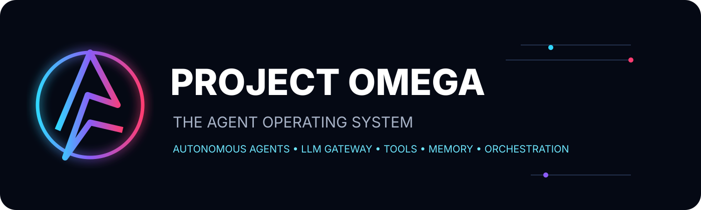
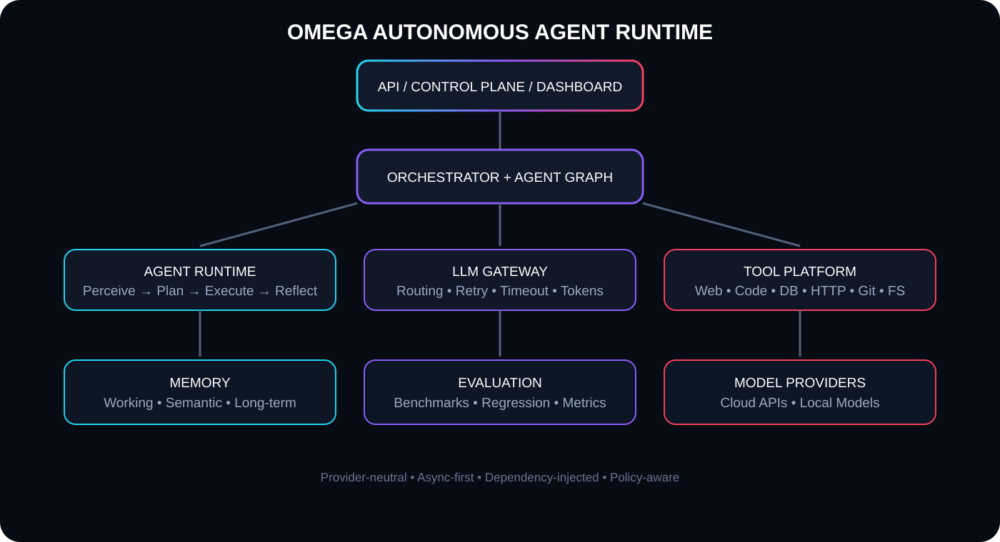

<div align="center">



# PROJECT OMEGA
### THE AGENT OPERATING SYSTEM

**An open-source runtime for autonomous, tool-using, multi-agent AI systems.**

[](https://www.python.org/)
[](LICENSE)
[](#design-principles)
[](SECURITY.md)
[](.github/workflows/ci.yml)

**Perceive → Plan → Execute → Reflect → Remember → Coordinate**

</div>

---

## What is OMEGA?

OMEGA is being built as an **Agent Operating System**: a modular control plane where autonomous agents can reason, call approved capabilities, remember context, coordinate with specialist agents, and operate against real software environments.

The core is intentionally provider-neutral. LLMs, tools, memory stores and persistence are injected through explicit interfaces instead of being hard-coded into the cognition loop.

> **Design goal:** make an agent a first-class runtime process rather than a single chat completion.

## System architecture

<p align="center"></p>

```text
                         ┌──────────────────────────────┐
                         │       CONTROL PLANE          │
                         │     API / Dashboard / CLI    │
                         └──────────────┬───────────────┘
                                        │
                         ┌──────────────▼───────────────┐
                         │        ORCHESTRATOR           │
                         │   Runs • Graphs • Budgets     │
                         └──────┬────────┬────────┬──────┘
                                │        │        │
                    ┌───────────▼──┐ ┌───▼────┐ ┌─▼──────────┐
                    │ AGENT RUNTIME│ │ MEMORY │ │ TOOL BUS   │
                    │ P/P/E/R      │ │ Vector │ │ Policy/ACL  │
                    └───────┬──────┘ └───┬────┘ └────┬───────┘
                            │            │             │
                            └────────────┼─────────────┘
                                         │
                              ┌──────────▼──────────┐
                              │     LLM GATEWAY     │
                              │ route/retry/timeout │
                              │    token budgets    │
                              └──────────┬──────────┘
                                         │
                         ┌───────────────┼───────────────┐
                         ▼               ▼               ▼
                      OpenAI         Anthropic      Local Models
```

## Core capabilities

| Subsystem | Capability | Status |
|---|---|---|
| 🧠 Agent Runtime | Perceive / Plan / Execute / Reflect loop | **Implemented** |
| 🕸️ Orchestrator | Run lifecycle, graph execution, cancellation, budgets | **Implemented** |
| ⚡ LLM Gateway | Routing, retries, timeouts, token accounting | **Implemented** |
| 🔌 Providers | OpenAI-compatible, Anthropic, local OpenAI-compatible APIs | **Implemented** |
| 🧰 Tool Registry | Schemas, validation, timeouts, permissions | **Implemented** |
| 🌐 Web Tool | Configured corpus search | **Implemented** |
| 🧮 Safe Code | Restricted arithmetic AST execution | **Implemented** |
| 📁 Filesystem | Root-sandboxed read/write/list | **Implemented** |
| 🗄️ Database | Parameterized SQLite execution | **Implemented** |
| 🔗 HTTP | Explicit host allow-list | **Implemented** |
| 🔀 Git | Read-only status/log/diff inspection | **Implemented** |
| 💾 Memory | In-memory + vector foundation | **Implemented** |
| 📊 Evaluation | Test/evaluation foundation | **In progress** |
| 📡 API / Realtime | Control plane + streaming events | **Planned** |
| 🖥️ Dashboard | React/TypeScript operations console | **Planned** |
| ☁️ Distributed Runtime | Queue/workers/checkpoints | **Planned** |

## Why the architecture matters

OMEGA separates **cognition, capabilities and coordination**.

```text
AGENT
  │
  ├── Cognition ──────── LLM Gateway
  │                         ├── cloud models
  │                         └── local models
  │
  ├── Capabilities ───── Tool Registry
  │                         ├── web
  │                         ├── code
  │                         ├── filesystem
  │                         ├── database
  │                         ├── HTTP
  │                         └── Git
  │
  ├── Context ────────── Memory
  │                         ├── working memory
  │                         ├── semantic retrieval
  │                         └── durable adapters
  │
  └── Coordination ───── Orchestrator
                            ├── single-agent runs
                            └── multi-agent graphs
```

This boundary lets an application replace a provider, database, vector store, queue or tool implementation without rewriting the agent core.

## Multi-agent vision

```text
                     ┌───────────────┐
                     │    PLANNER    │
                     └───────┬───────┘
                             │
             ┌───────────────┼────────────────┐
             ▼               ▼                ▼
       ┌───────────┐   ┌───────────┐    ┌───────────┐
       │ RESEARCHER│   │   CODER   │    │  ANALYST  │
       └─────┬─────┘   └─────┬─────┘    └─────┬─────┘
             │               │                │
             └───────────────┼────────────────┘
                             ▼
                     ┌───────────────┐
                     │    REVIEWER   │
                     └───────┬───────┘
                             ▼
                     ┌───────────────┐
                     │ FINAL RESULT  │
                     └───────────────┘
```

A graph can combine specialist agents without coupling their internal reasoning logic to the orchestration layer.

## Tool security model

OMEGA treats tools as privileged capabilities, not arbitrary functions.

- Explicit registration and schemas.
- Per-agent allow-lists.
- Execution timeouts.
- Sandboxed filesystem root.
- HTTP host allow-list support.
- Parameterized database operations.
- Read-only Git integration in the baseline platform.
- No unrestricted Python execution in the core runtime.
- Secrets stay outside source control.

See [SECURITY.md](SECURITY.md).

## Quick start

```bash
git clone https://github.com/0388580298co-dot/AI-Agent-Hub-Project-OMEGA.git
cd AI-Agent-Hub-Project-OMEGA

python -m venv .venv
# Linux/macOS
source .venv/bin/activate
# Windows PowerShell: .venv\Scripts\Activate.ps1

pip install -e ".[dev]"
pytest -q
```

Run the reference scenario:

```bash
python example.py
```

The runtime can operate without a cloud provider when using the dependency-free components and injected local/mock providers.

## Repository map

```text
AI-Agent-Hub-Project-OMEGA/
│
├── src/omega/
│   ├── agents/              # agent lifecycle + factory
│   ├── orchestrator/        # execution + multi-agent coordination
│   ├── llm_models/          # gateway + providers + token budgets
│   ├── tools/               # registry + secure capability adapters
│   └── memory/              # memory and vector abstractions
│
├── tests/
│   ├── unit/                # isolated component tests
│   ├── integration/         # subsystem integration tests
│   └── e2e/                 # end-to-end scenarios
│
├── docs/
│   ├── ARCHITECTURE.md      # detailed architecture
│   ├── architecture.svg     # system visual
│   └── hero.svg             # project visual identity
│
├── .github/workflows/       # automated quality checks
├── example.py               # runnable reference workflow
├── pyproject.toml           # packaging + dev tooling
├── CONTRIBUTING.md
├── SECURITY.md
└── LICENSE
```

## Engineering principles

- **Async-first:** I/O does not block the orchestration loop.
- **Dependency injection:** integrations are replaceable boundaries.
- **Typed contracts:** public runtime structures use explicit type hints.
- **Bounded autonomy:** iteration, timeout and token budgets are first-class controls.
- **Cancellation-aware:** a cancelled run propagates cancellation rather than hiding it.
- **Secure-by-default:** capabilities require explicit registration and authorization.
- **Observable:** orchestration boundaries are designed for tracing and metrics.
- **Provider-neutral:** the runtime does not depend on one model vendor.

## Roadmap

```text
PHASE 1  Core Agent Runtime           ████████████████████  DONE
PHASE 2  LLM Gateway                  ████████████████████  DONE
PHASE 3  Tool Platform                ████████████████████  DONE
PHASE 4  Persistent Memory            ████████░░░░░░░░░░░░  NEXT
PHASE 5  Durable Agent Graphs         ░░░░░░░░░░░░░░░░░░░░  NEXT
PHASE 6  Sandbox Workers              ░░░░░░░░░░░░░░░░░░░░  NEXT
PHASE 7  Evaluation & Regression      ░░░░░░░░░░░░░░░░░░░░  NEXT
PHASE 8  Observability                ░░░░░░░░░░░░░░░░░░░░  NEXT
PHASE 9  API + WebSocket              ░░░░░░░░░░░░░░░░░░░░  NEXT
PHASE 10 React Operations Console     ░░░░░░░░░░░░░░░░░░░░  NEXT
PHASE 11 Docker + Kubernetes          ░░░░░░░░░░░░░░░░░░░░  NEXT
PHASE 12 Distributed Agent Runtime   ░░░░░░░░░░░░░░░░░░░░  NEXT
```

> The status above describes the repository implementation state, not a claim that every planned production infrastructure component already exists.

## Documentation

- [Architecture & Workflow](docs/ARCHITECTURE.md)
- [Contributing](CONTRIBUTING.md)
- [Security Policy](SECURITY.md)
- [Reference example](example.py)

## License

Apache-2.0 — see [LICENSE](LICENSE).

<div align="center">

### OMEGA is designed to grow from a Python runtime into a complete agent control plane.

**Build agents. Connect tools. Route models. Coordinate intelligence.**

</div>
